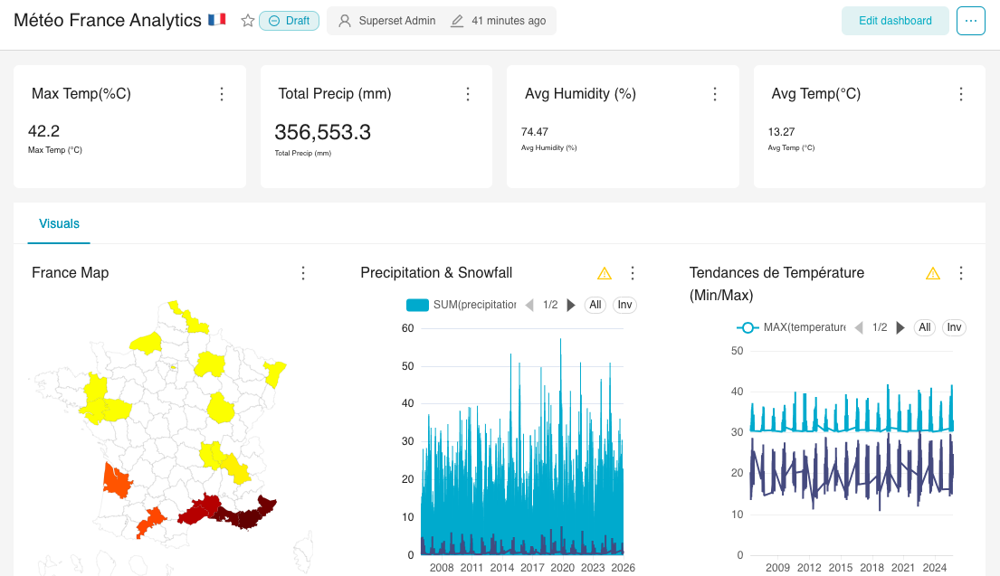
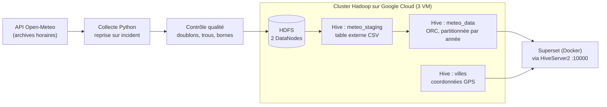

# Eco Trend — 20 ans de météo française sur un cluster Hadoop

Pipeline de données de bout en bout : collecte de l'historique météo horaire de 20 grandes villes françaises via l'API Open-Meteo, stockage distribué sur un cluster Hadoop déployé à la main sur Google Cloud, entrepôt Hive optimisé, et tableau de bord Apache Superset.

Projet universitaire de Master 1 Informatique et Big Data (Université Paris 8), réalisé à deux avec **Ronic Takougang**.



## En chiffres

- **3 725 256** relevés horaires chargés dans Hive, 20 villes, 27 variables météo
- **3 machines virtuelles** GCP (1 maître, 2 nœuds de données), réplication HDFS ×2
- Table analytique **ORC partitionnée par année** : une requête sur une année ne lit que cette année

## Architecture



## Étapes du pipeline

**1. Collecte** (`ingestion/collect.py`)
Un appel à l'API par ville et par année civile. Chaque réponse est écrite dans son propre fichier de façon atomique (fichier temporaire puis renommage). Une coupure réseau ou un arrêt manuel ne laisse donc jamais de fichier à moitié écrit, et relancer la commande reprend exactement là où elle s'était arrêtée, sans re-télécharger ni créer de doublon. Les heures sont demandées en UTC pour éviter les heures en double ou manquantes aux changements d'heure.

**2. Résilience face à l'API** (`ingestion/client.py`)
Les erreurs temporaires (limite d'appels 429, erreurs serveur, timeout) sont réessayées avec une attente exponentielle qui respecte l'en-tête `Retry-After`. Le nombre de tentatives est borné, et une erreur définitive (requête invalide) arrête tout de suite au lieu de boucler.

**3. Contrôle qualité** (`ingestion/quality.py`)
Avant tout chargement : colonnes attendues, doublons ville/heure (bloquants), heures manquantes, valeurs vides et valeurs physiquement aberrantes (signalées).

**4. Chargement HDFS** (`scripts/load_to_hdfs.sh`)
Relance le contrôle qualité puis dépose le CSV et la table des villes dans HDFS, aux emplacements lus par les tables externes Hive.

**5. Modélisation Hive** (`hive/`)
- `01_staging.sql` : table externe sur le CSV brut ;
- `02_meteo_data.sql` : table ORC compressée, partitionnée par année, alimentée par partitionnement dynamique ;
- `03_villes.sql` : table de référence des coordonnées, utilisée par la carte.

**6. Restitution** (`hive/requetes/`, `scripts/deploy_superset.sh`)
Superset tourne dans un conteneur Docker pour isoler ses dépendances Python de celles d'Hadoop. Il est exposé sur le port 8080, car YARN occupe déjà le 8088, et il interroge Hive par l'IP du nœud maître, puisque `localhost` désigne le conteneur lui-même. Requêtes du tableau de bord : indicateurs clés, évolution mensuelle des températures, cumuls de pluie et de neige, tendance annuelle par ville, carte.

## Lancer le projet

```bash
pip install -r requirements.txt

# Collecte (par défaut 20 ans x 20 villes ; long, l'API impose d'espacer les appels)
python -m ingestion.collect
# Essai rapide sur un petit périmètre
python -m ingestion.collect --cities Paris,Lyon --start 2024-01-01 --end 2024-12-31

python -m ingestion.quality data/meteo_data.csv
```

Sur le nœud maître du cluster :

```bash
scripts/load_to_hdfs.sh
scripts/start_hiveserver2.sh
scripts/run_hive.sh
SUPERSET_ADMIN_PASSWORD='...' scripts/deploy_superset.sh
```

## Tests

```bash
python -m pytest
```

14 tests, sans appel réseau (API simulée) :
- découpage des périodes ;
- réessais, respect de `Retry-After`, abandon borné ;
- reprise après interruption sans doublon ;
- contrôle qualité ;
- cohérence entre le CSV et le schéma Hive.

## Structure

```
ingestion/        collecte (config, client API, collecte, contrôle qualité)
hive/             tables staging, ORC partitionnée, référence villes
hive/requetes/    requêtes du tableau de bord
scripts/          chargement HDFS, HiveServer2, exécution Hive, déploiement Superset
data/villes.csv   coordonnées des 20 villes
tests/            tests pytest
docs/             capture du tableau de bord
```

## Limites et pistes

- Cluster monté à la main sur des VM pour comprendre chaque configuration (HDFS, YARN, Hive). En production, un service géré comme Dataproc serait plus adapté.
- Chargement complet à chaque exécution. Une suite naturelle serait un chargement incrémental de l'année en cours, orchestré par Airflow.

## Stack technique

Python (requests, pandas, pytest) · Hadoop HDFS / YARN · Hive (ORC, partitionnement) · Google Cloud Compute Engine · Docker · Apache Superset
